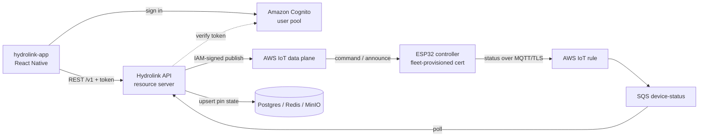

# Hydrolink API

Hydrolink started with a real need: controlling the irrigation on a countryside property without
checking on it constantly. It grew into a full IoT platform where ESP32 firmware, a Spring Boot API,
and a React Native app each run a layer and control real hardware. This repository is the backend
that connects them. It registers devices, links them to user accounts, tracks pin configuration and
watering schedules, ingests live device status over AWS IoT, and orchestrates over-the-air firmware
updates.

The mobile app that talks to this API is a separate, public repository:

- [hydrolink-app](https://github.com/ivfrost/hydrolink-app) React Native companion app

The ESP32 firmware is closed source.

What works today:

- Identity handled by Cognito; the API verifies tokens and binds each Cognito user to a local row
- Device linking tied to a per-device secret
- Live device status ingested through AWS IoT, with user and device management from the mobile app
- Watering schedules per day, held here and pushed down to the device
- Over-the-air firmware updates triggered from an upload

## Stack

- Java 25, Spring Boot 4.1, Spring Modulith for bounded modules
- PostgreSQL 16 for data, Redis for cache, MinIO for firmware binaries and images
- AWS IoT Core as the single message bus; the self-hosted MQTT broker was retired
- OAuth2 resource server validating Cognito-issued JWTs (the app sends a bearer token; the API
  never sees a password)
- Dockerized dev and production profiles, fail-fast configuration with no defaults

## Architecture

Device status is moved from AWS IoT Core into a standard SQS queue; commands are published back to
devices with the AWS IoT data plane Publish API. There is no self-hosted broker and the API holds no
device certificate. Identity lives in Cognito: the mobile app signs in there and sends the token to
the API, while the ESP32 talks to AWS IoT Core directly with its own fleet-provisioning certificate.



An IoT rule forwards only what its SQL selects (`SELECT *, topic(2) AS deviceKey FROM
'hydro/+/status'`), so it stamps `topic(2)` back as `deviceKey` on each message before it reaches SQS.
Devices publish status, presence, pin configuration, and station state on that topic; the API pushes
commands back on `command` and `announce`. Status payloads are complete snapshots rather than deltas,
and each handler writes only the state its message carries (pin modes are upserted per device and pin,
unrecognized modes are skipped with a warning). Because SQS delivers at least once, duplicates land on
the same result, so there is no ordering dependency.

Outbound commands go through a `CommandGateway` interface implemented by `AwsCommandGateway`. The
gateway builds topics only as `hydro/{deviceKey}/command` and `hydro/{deviceKey}/announce` and
publishes each with IAM. The corresponding IoT policies restrict publish to those exact topic
shapes, so status and secret feeds are not writable by this backend.

## Modules

Spring Modulith keeps each domain behind a clean boundary, with cross-module access going through a
small published API.

| Module      | What it owns |
|-------------|--------------|
| `users`     | Accounts, roles, profile, Cognito sub binding, device link/unlink |
| `devices`   | Device records, ownership secrets, pins, provisioning, secrets rotation |
| `schedules` | Per-day watering schedules and time windows, pushed to devices |
| `storage`   | MinIO uploads and OTA firmware lifecycle with versioned releases |
| `config`    | Security wiring, the Cognito client, the command gateway seam, AWS/SQS and object-store config |

## Notable pieces

- **Identity is Cognito's, not the API's.** The app authenticates against Cognito directly and sends
  the ID token as a bearer token. The API verifies it, then maps the `sub` to a local row
  (`findBySub`, else bind by email, else create). `POST /v1/verify-sync` lets the app materialize its
  row right after sign-in.
- **Device provisioning is two separate planes.** A device record is an application-side row,
  created through an internal endpoint when firmware boots and linked by an ownership secret. The
  AWS Thing is provisioned separately by the device via AWS claim provisioning; the two never share
  an identifier.
- **Secret rotation is two-phase.** Regenerating a device secret does not make it authoritative
  until a `secret_rotated` acknowledgement comes back from the device, so a failed rotation leaves
  the old secret valid.
- **Sensitive changes require a recent login.** The email change is gated on the token's `auth_time`
  and confirmed through Cognito; a pending change is tracked with a read-time TTL so an abandoned
  request cannot squat an address.
- **Over-the-air firmware updates.** Firmware is uploaded to MinIO with a version and checksum,
  then announced to matching devices on the `/announce` topic. Install can be forced even when the
  device reports the same version.
- **Pin reporting.** Devices publish their pin configuration, and the API stores each pin mode by
  device and pin number, skipping unrecognized modes with a warning instead of guessing at them.
- **Schedules.** Per-day watering schedules with fixed or existing-window-linked time windows. Upserting
  persists the schedule, publishes it to the device, and returns which time windows conflict with
  each other in the response.

## Run locally

Requirements: Docker and a JDK matching the Java target in `pom.xml`. No value has a default
anywhere, so copy `.env.example` to `.env` and fill in every value first, the app fails fast
otherwise.

```bash
cp .env.example .env   # fill everything, generation hints are in the file
./mvnw -Dspring-boot.run.profiles=dev spring-boot:run
```

The `dev` profile enables the Spring Boot Docker Compose starter, so Postgres, Redis, and MinIO
start on their own. Other useful settings:

- Cognito values (`AWS_USER_POOL_ID`, `AWS_USER_POOL_CLIENT_ID`, `AWS_REGION`) are required; the
  issuer URI and audience are derived from them per profile
- Dev seeding creates a Cognito admin user and binds the local row to its sub, and seeds two devices
- `AWS_ACCESS_KEY_ID` / `AWS_SECRET_ACCESS_KEY` are required in dev for the SQS listener and the
  Cognito admin API; stage and prod resolve credentials from the deployment role instead
- Reset the Postgres schema before boot if you edited the single V1 migration and Flyway checksums
  no longer match
- Swagger UI is available at `/api-docs-ui` on the dev profile; stage and production disable it
  unless `SPRINGDOC_API_DOCS_ENABLED` is set to `true`

Profiles map to `dev`, `stage`, `prod`, and `test`.

## API documentation

The router is grouped into two OpenAPI specs so internal endpoints never leak to consumers:

- `public`: everything under `/v1`, minus `/v1/internal/**`
- `internal`: only `/v1/internal/**`, used for device-record registration and pin reporting

Specs are served on `/api-docs.yaml/public` and `/api-docs.yaml/internal`. The docs toggle is
environment-driven (`SPRINGDOC_API_DOCS_ENABLED`, `SPRINGDOC_SWAGGER_UI_ENABLED`), so stage and
production keep it off unless explicitly enabled.

## Deployment

A multi-stage Dockerfile packages the app as a JRE runtime image running as a non-root user.
`docker-compose.prod.yml` composes the API with Postgres, Redis, and MinIO, each with a healthcheck,
and relies on environment variables for real values. TLS terminates on a
reverse proxy in front of the app, and `server.forward-headers-strategy=framework` is set for that.
The AWS side of the infrastructure (rule, SQS, IoT data plane, Cognito pool) lives in the region set 
by `AWS_REGION`, currently eu-west-1.

As of this time in the development, only the `dev` environment is stable and the migration away from
self-hosted broker and self-rolled JWT tokens into the AWS managed services (Cognito & IoT Core) will
require the stage and prod environments to be adapted. Before this, I used to run the full stack 
self-hosted via Coolify.

AWS credentials are configured through `spring.cloud.aws.credentials.access-key` /
`secret-key`, which the `dev` profile reads from `.env`. Every other profile resolves credentials from
the deployment role through the AWS default credentials chain, so no static keys are needed in stage
or production.

## License

Released under the
[Creative Commons Attribution-NonCommercial 4.0 International](LICENSE) license. Noncommercial use
is fine; any other use needs permission.
